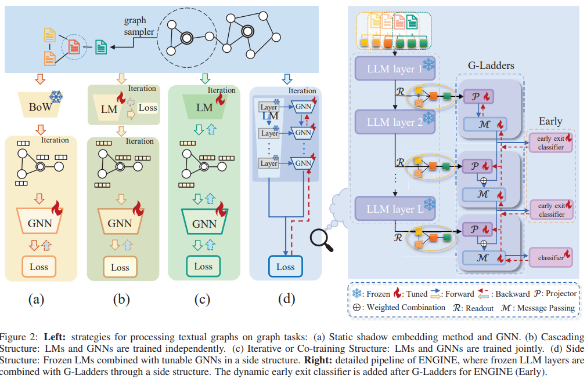

# Efficient Tuning and Inference for Large Language Models on Textual Graphs

**Official implementation of paper** [Efficient Tuning and Inference for Large Language Models on Textual Graphs](https://arxiv.org/abs/2401.15569)

Yun Zhu*, Yaoke Wang*, Haizhou Shi, Siliang Tang†

In IJCAI 2024

> This repository is still on progress.

## Overview
In this paper, we propose ENGINE, a *parameter- and memory-efficient fine-tuning method* for textual graphs with LLM encoder as depicted in Figure 2(Right). The key insight is to combine the LLMs and GNNs through a *tunable side structure*, which significantly reduces the training complexity without impairing the joint model's capacity.



## Environments

1. virtual environment: `conda create --name llama python=3.9 -y`
2. install torch (>=2.0.1): `pip install torch==2.0.1+cu117 torchvision==0.15.2+cu117 torchaudio==2.0.2 --index-url https://download.pytorch.org/whl/cu117`
3. install related packages: `pip install llama-recipes transformers datasets accelerate sentencepiece protobuf==3.20 py7zr scipy peft bitsandbytes fire torch_tb_profiler ipywidgets`
4. get License for downloading weights: [https://ai.meta.com/resources/models-and-libraries/llama-downloads/](https://ai.meta.com/resources/models-and-libraries/llama-downloads/)
5. download mode weights：`git clone https://github.com/facebookresearch/llama`

   -`cd llama`

   -`sh download.sh`
6. change into hugging face format: `python <anaconda path>/envs/llama/lib/python3.9/site-packages/transformers/models/llama/convert_llama_weights_to_hf.py --input_dir <Weights_PATH> --model_size <size> --output_dir <Outout_PATH>`

   -`https://github.com/facebookresearch/llama-recipes#model-conversion-to-hugging-face`
7. install pyg: `pip install torch_geometric`
8. Optional dependencies: `pip install torch_scatter torch_sparse`

## Download Datasets

For `citeseer, wikics, photo` datasets, you can download them from [link](https://drive.google.com/drive/folders/1bSRCZxt0c11A3717DYDjO112fo_zC8Ec?usp=sharing) and put them in `preprocessed_data/new`.
And you can download other datasets with raw text in [https://github.com/XiaoxinHe/TAPE](https://github.com/XiaoxinHe/TAPE) and put them into `datasets` dir.

## Runing Commands

### Baselines for Traditional GNNs


```
# GNN

CUDA_VISIBLE_DEVICES=5 python traditional_gnn.py --config ./configs/cora/gnn.yaml

CUDA_VISIBLE_DEVICES=5 python traditional_gnn.py --config ./configs/<dataset>/gnn.yaml

```


```
# GNN+Subsampling

CUDA_VISIBLE_DEVICES=5 python traditional_gnn.py --config ./configs/cora/subgnn.yaml

CUDA_VISIBLE_DEVICES=5 python traditional_gnn.py --config ./configs/<dataset>/subgnn.yaml

```
> `dataset` can be set as `cora`, `citeseer`, `wikics`, `products`, `arxiv`, `arxiv_2023`, `photo`.

### Baselines for finetuning LMs

```

CUDA_VISIBLE_DEVICES=4 python finetune_lm.py --dataset cora --lm_type bert --epochs 4 --lr 5e-5 --batch_size 6

```


### Baselines for PEFT of LLMs

```

CUDA_VISIBLE_DEVICES=4 python llm.py --peft ia3 --dataset cora --lr 1e-2 --epochs 10 --batch_size 16

```


### Running commands for our method

1. generate cache:

```
python cache.py --dataset citeseer
```

2. running ENGINE w/ caching:

```
# For simplicity, we use caching for all samples here. However, in real-world scenarios, access to test samples in advance may not be available. The forthcoming version of this repository, ENGINE w/o caching will be provided. It is imperative to highlight that in Table 4, caching is not utilized.

CUDA_VISIBLE_DEVICES=3 python main.py --config ./configs/citeseer/engine.yaml

```

2. running ENGINE (Early):

```
# For simplicity, we use caching for all samples here. However, in real-world scenarios, access to test samples in advance may not be available. The forthcoming version of this repository, ENGINE w/o caching will be provided. It is imperative to highlight that in Table 4, caching is not utilized.

CUDA_VISIBLE_DEVICES=3 python main.py --config ./configs/citeseer/engine.yaml --early

```